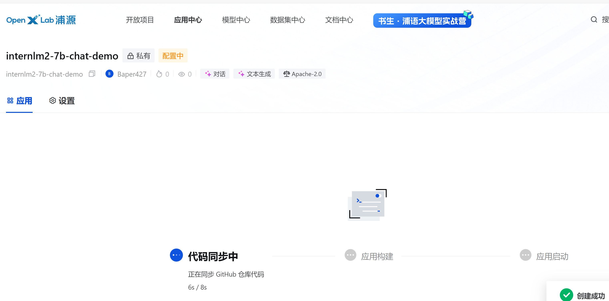
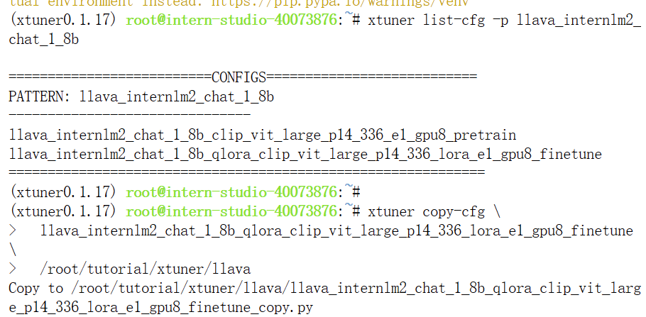
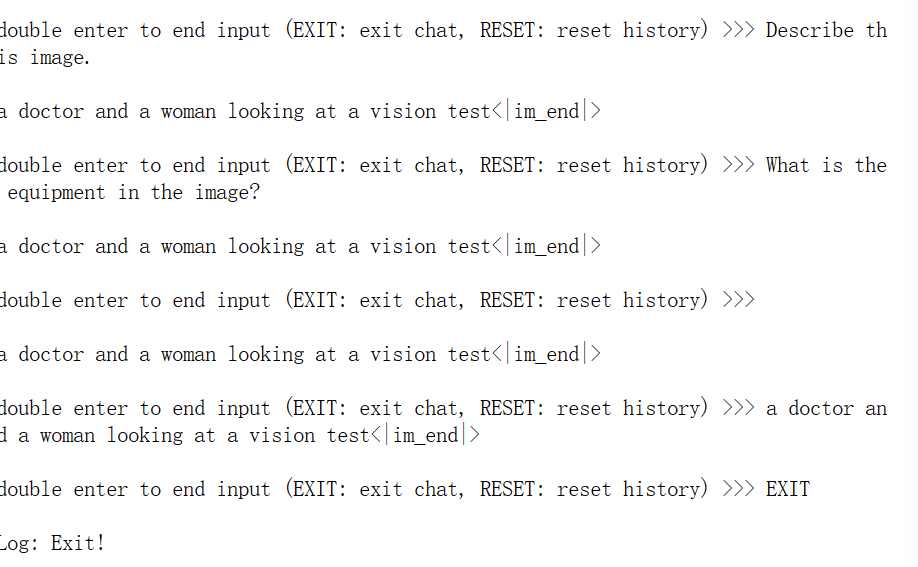
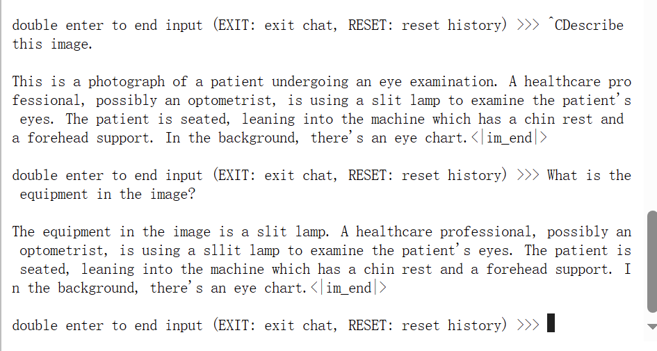

### 生成数据集

使用XTuner 工具箱中的第二个工具 `copy-cfg，生成文件`

开始训练和在检查点测试

上图可见，600轮时出现严重过拟合

### hugging face(lora)转化

##### 端口转发后打开web demo

同步github项目，创建文件和上传模型，在openxlab上部署应用

### 多模态微调

安装环境和查看配置文件

微调前

微调后
