#### 安装环境

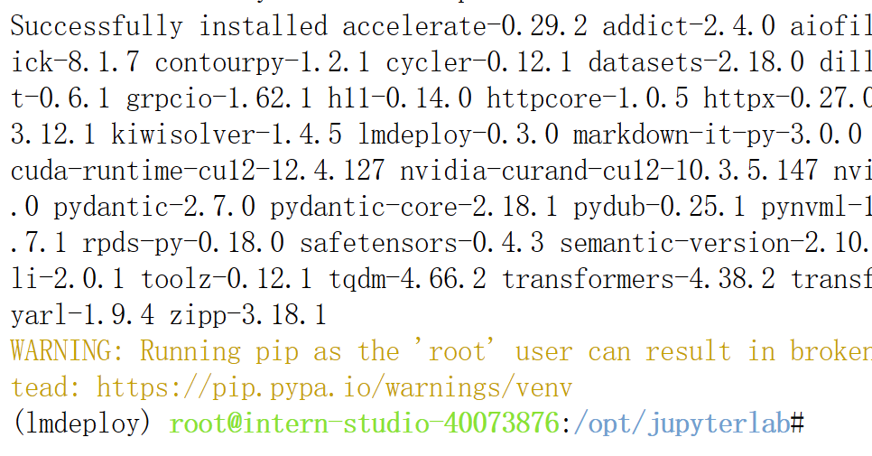

#### 创建和运行pipeline_transformer

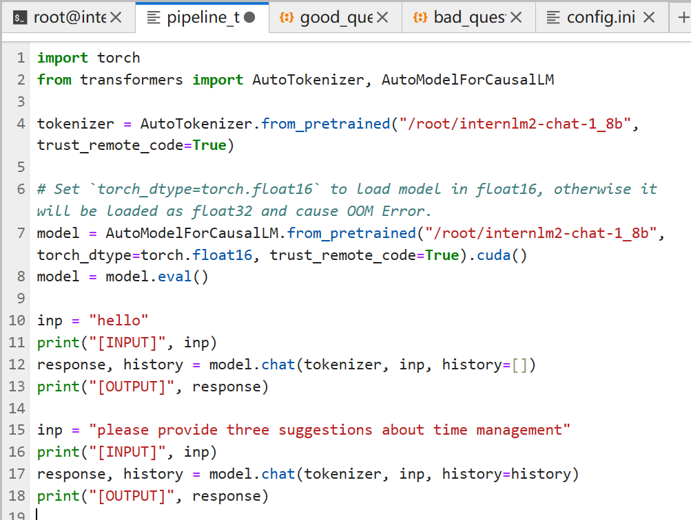

#### 直接运行模型

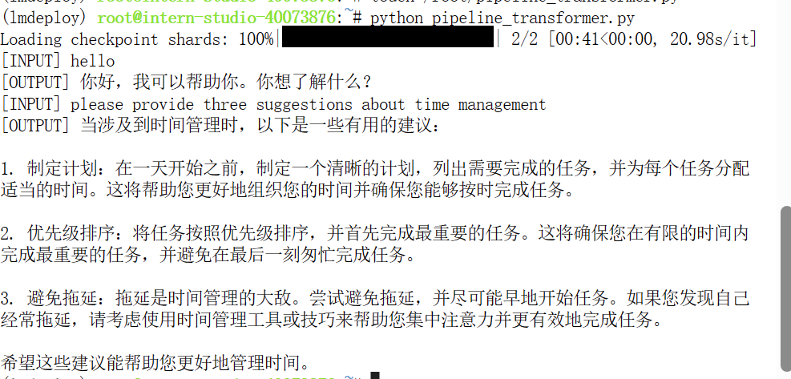

花费时间较长，大约5min左右

###### 命令行对话

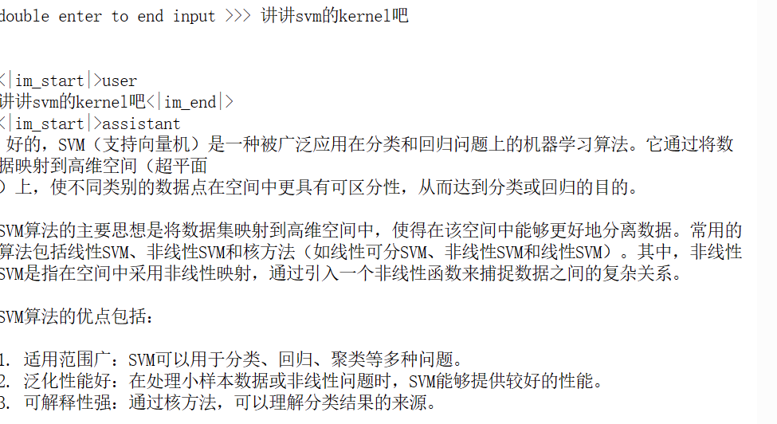

通过资源监视器可以看到资源显存已经被吃满8g

改变 `--cache-max-entry-count`参数，设为0.5。

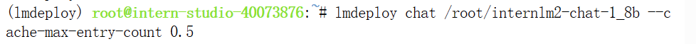

但是生成token的速度进一步延长了，体感上两倍不止，下图为限制缓存后的输出

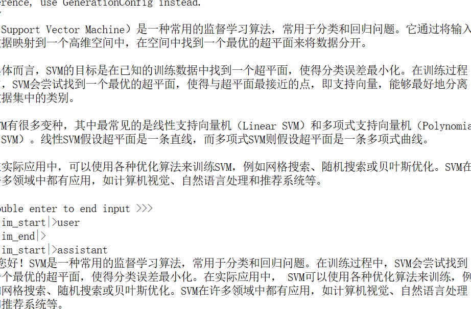

###### 量化

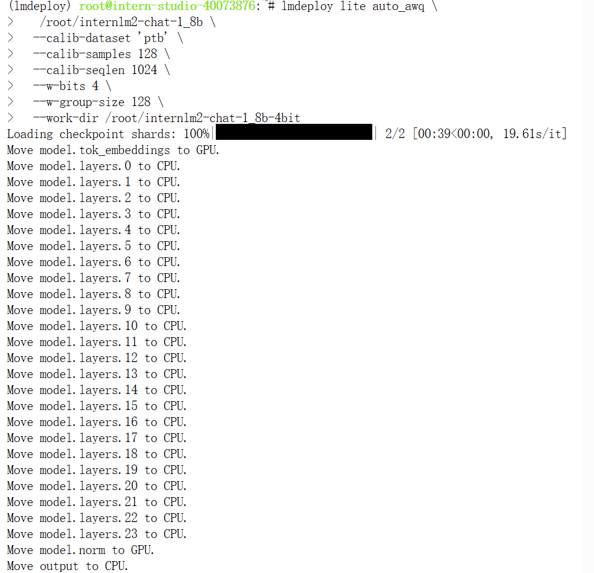

###### 显存占用明显降低

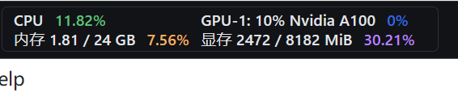

#### API服务器：

在完成端口转发和后台启动后

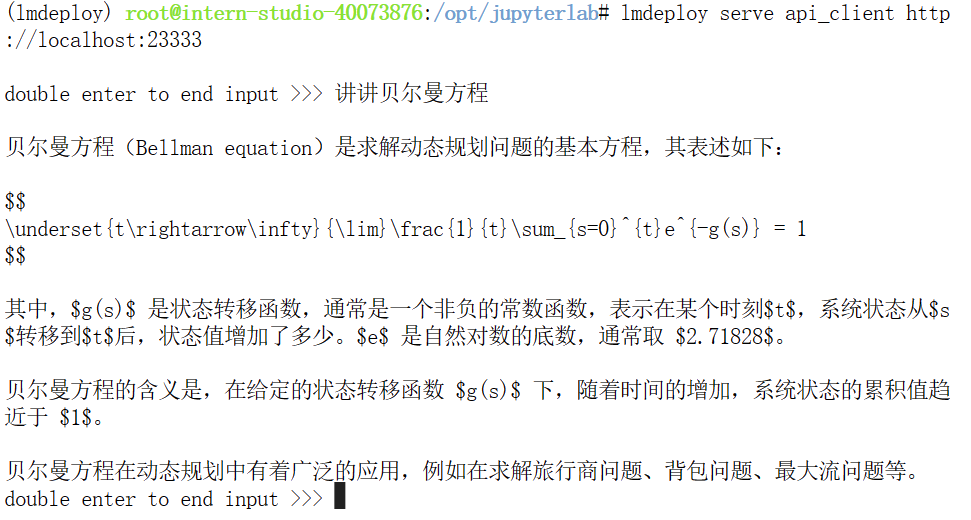

gradio前端

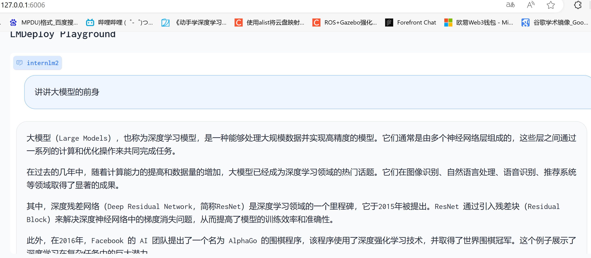

Python集成代码运行

修改代码

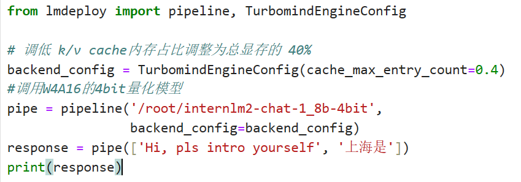

速度有明显提升

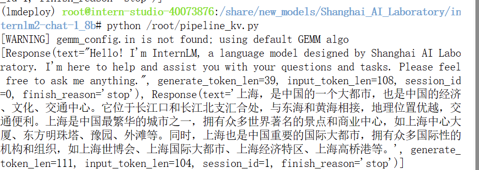

###### llava多模态运行

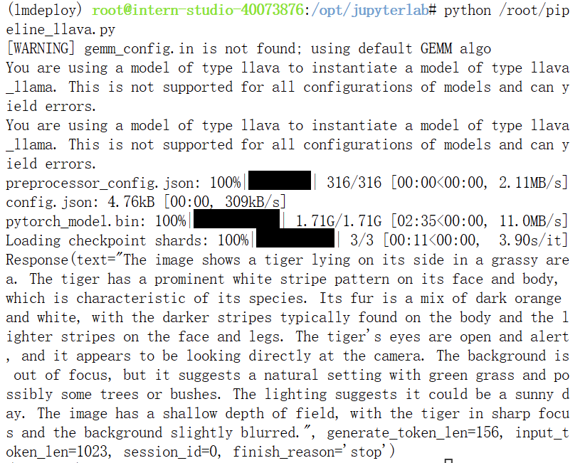

gradio运行llava

