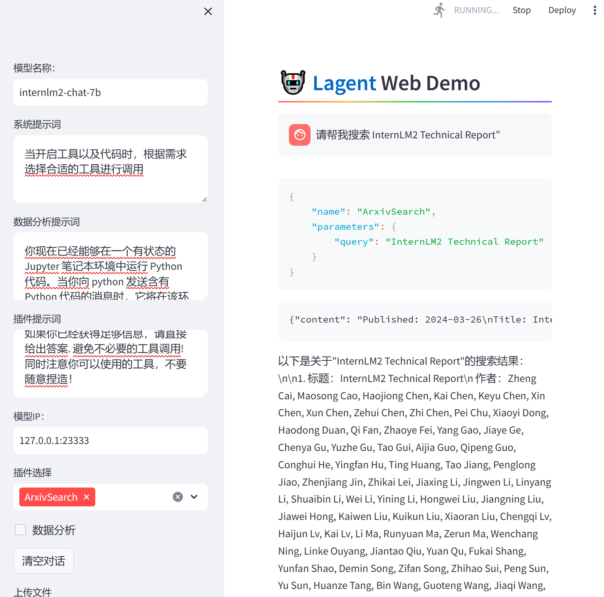
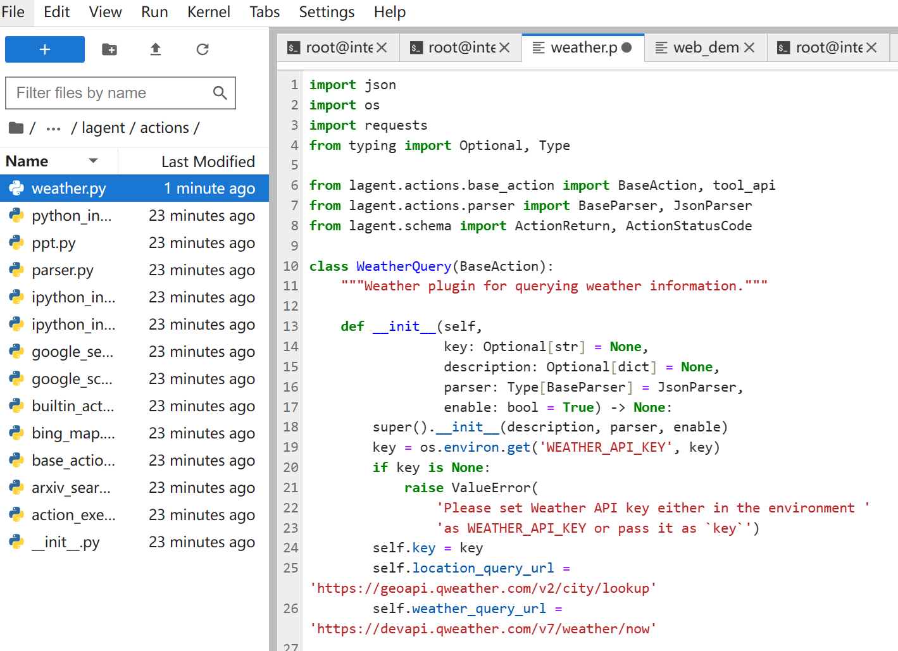
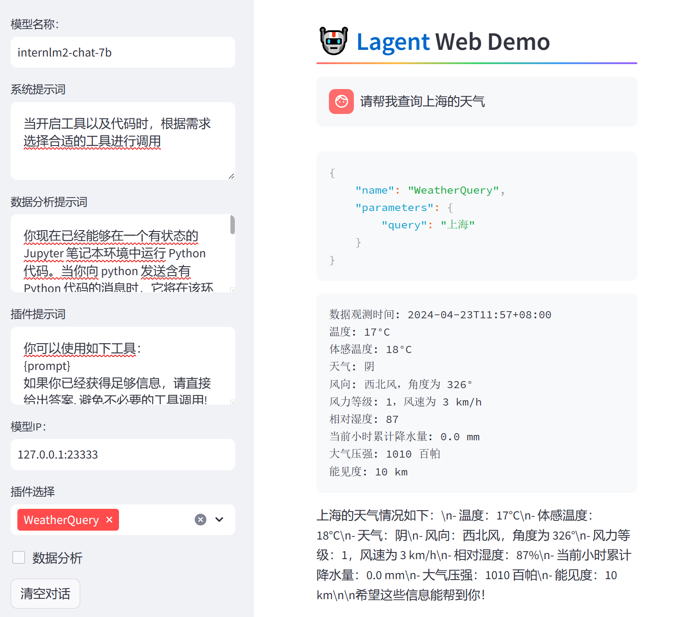
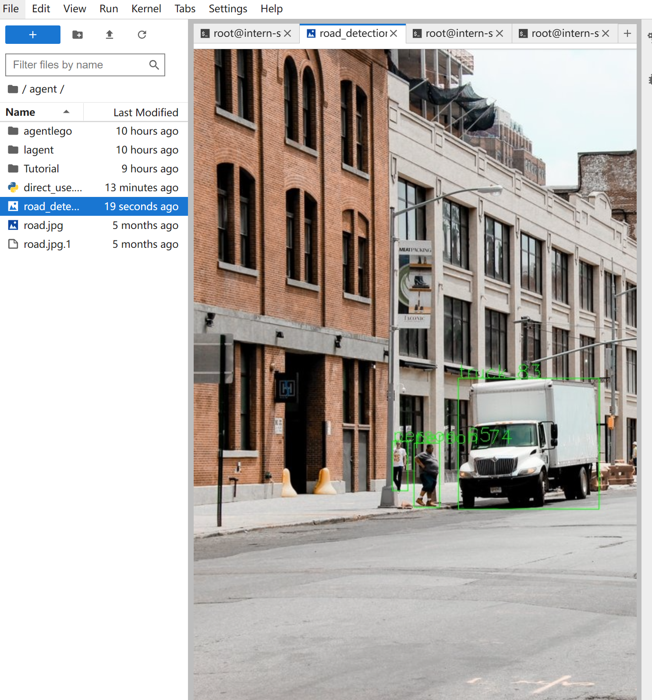
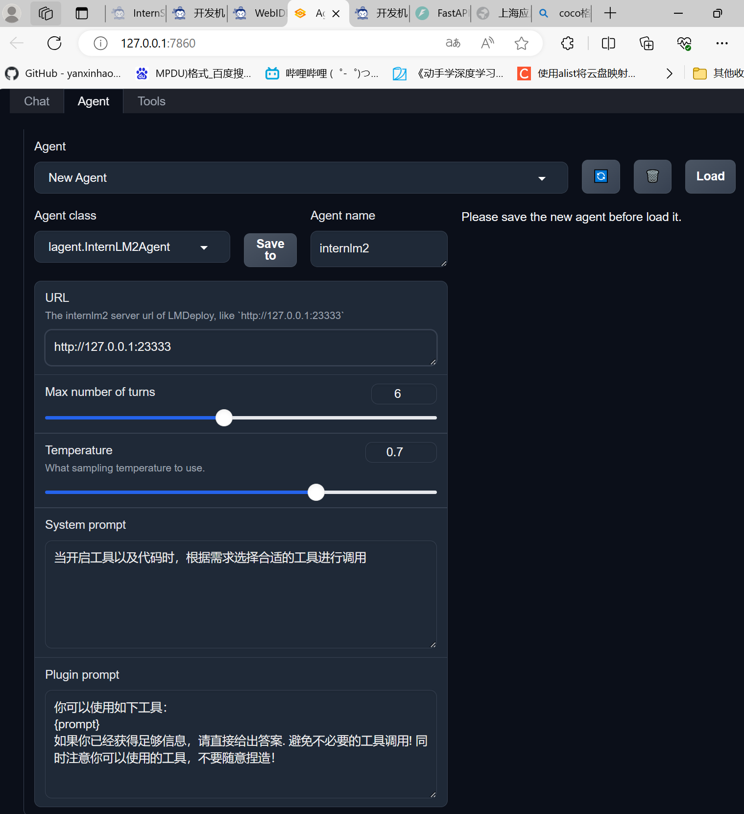
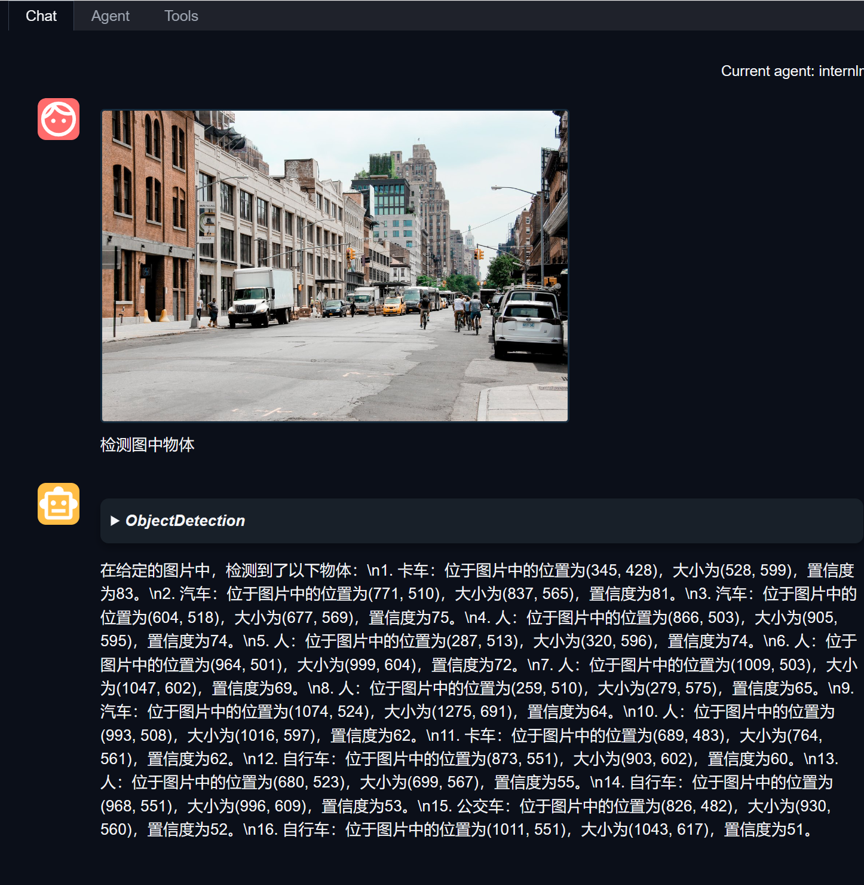
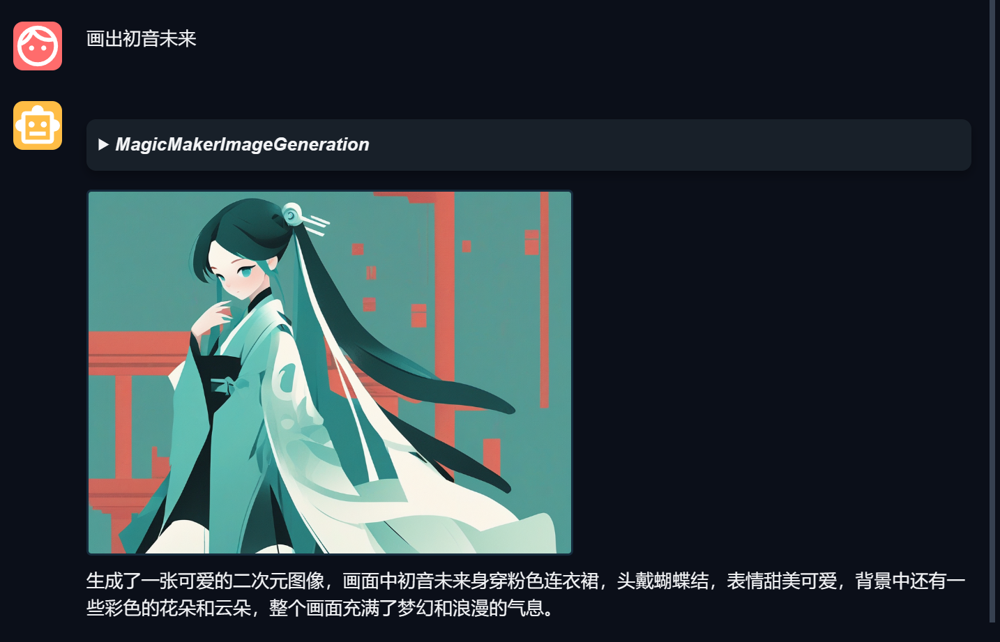

### 1.Lagent

```
base) root@intern-studio-40073876:~# conda activate agent
(agent) root@intern-studio-40073876:~# cd /root/agent/lagent/examples
(agent) root@intern-studio-40073876:~/agent/lagent/examples# streamlit run internlm2_agent_web_demo.py --server.address 127.0.0.1 --server.port 7860

Collecting usage statistics. To deactivate, set browser.gatherUsageStats to false.


  You can now view your Streamlit app in your browser.

  URL: http://127.0.0.1:7860

```

安装好必要库后启动web端



图1.1

选择模型和插件，开始搜索



图1.2

创建修改weather.py



图1.3查询天气

### 2.agentlego



图2.1安装openmmlab'并进行检测和推理



图2.2启动webui legoagnet

图2.3运行目标检测agent




图2.4注册生成图agent
